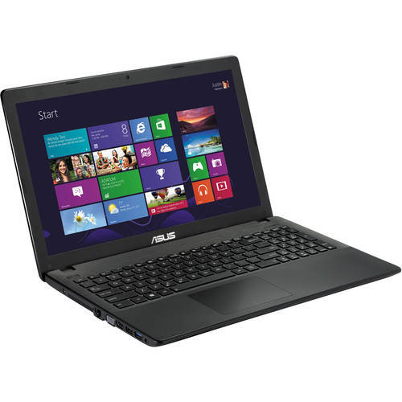

<h1>1.Introduction to Computer Systems</h1>         

Full Form Of Computer:

C – Commonly

O – Operated

M – Machine

P – Particularly

U – Used for

T – Technical

E – & Education

R – Research

Definition: A computer is an electronic machine that accepts data and instruction from its users, processes it and produces a desired output.

<h2>1.1. Explanation of the Definition</h2>

Electronic Machine: A device that runs on electricity.

Accepts data/instruction: It wants its users to provide the necessary data and give instructions on what needs to be done with those data.

Processes it: A computer then tries to understand the instruction and then takes necessary actions on it.

Output: Output simply means the result. after understand and taking necessary actions on the data provided by the user a Computer provides a result.

Therefore from the above explanation we can understand that a computer is a machine that run on electricity and asks data/ instructions from its users and depending on the data and instructions it provides some result.

<h2>1.2. Technical terms</h2>

<h3>1.2.1. Input</h3>
The data or instructions that are given to a computer.

<h3>1.2.2. Output</h3>
The result that is produced by a Computer after carrying out the necessary actions on the data depending on the instruction given by the user.

<h3>1.2.3. Processing</h3> 
The necessary steps taken by a computer system on the data depending on the instruction of the users.

<h2>1.3. Characteristics of Computer</h2>

<h3>1.3.1. Speed</h3>
A computer works with much higher speed and accuracy compared to humans while performing mathematical calculations. Computers can process millions (1,000,000) of instructions per second. The time taken by computers for their operations is microseconds and nanoseconds.

<h3>1.3.2. Accuracy</h3>
Computers perform calculations with 100% accuracy. Errors may occur due to data inconsistency or inaccuracy.

<h3>1.3.3. Diligence</h3>
A computer can perform millions of tasks or calculations with the same consistency and accuracy. It doesn’t feel any fatigue or lack of concentration. Its memory also makes it superior to that of human beings.

<h3>1.3.4. Versatility</h3>
Versatility refers to the capability of a computer to perform different kinds of works with same accuracy and efficiency.

<h3>1.3.5. Reliability</h3>
A computer is reliable as it gives consistent result for similar set of data i.e., if we give same set of input any number of times, we will get the same result. 

<h3>1.3.6. Automation</h3>
Computer performs all the tasks automatically i.e. it performs tasks without manual intervention.

<h3>1.3.7. Memory</h3>
A computer has built-in memory called primary memory where it stores data. Secondary storage are removable devices such as CDs, pen drives, etc., which are also used to store data.

<h2>1.4. Drawbacks of Computer</h2>

<h3>1.4.1. Unemployment</h3>
Different tasks are performed automatically by using computers. It reduces the need of people and increases unemployment in society.

<h3>1.4.2. Wastage Of Time And Energy</h3>
Many people use computers without positive purpose. They play games and chat for a long period of time. It causes wastage of time and energy. Young generation is now spending more time on the social media websites like Facebook, Twitter etc or texting their friends all night through smartphones which is bad for both studies and their health. And it also has adverse effects on the social life.

</h3>1.4.3. Data Security</h3>
The data stored on a computer can be accessed by unauthorized persons through networks. It has created serious problems for the data security.

<h3>1.4.4. Computer Crimes</h3>
People use the computer for negative activities. They hack the credit card numbers of the people and misuse them or they can steal important data from big organizations.

<h3>1.4.5. Privacy Violation</h3>
The computers are used to store personal data of the people. The privacy of a person can be violated if the personal and confidential records are not protected properly.

<h3>1.4.6. Health Risks</h3>
The improper and prolonged use of computer can results in injuries or disorders of hands, wrists, elbows, eyes, necks and back. The users can avoid health risks by using the computer in proper position. They must also take regular breaks while using the computer for longer period of time. It is recommended to take a couple of minutes break after 30 minutes of computer usage.

<h3>1.4.7 Impact On Environment</h3>
The computer manufacturing processes and computer waste are polluting the environment. The wasted parts of computer can release dangerous toxic materials. Green computer is a method to reduce the electricity consumed and environmental waste generated when using a computer. It includes recycling and regulating manufacturing processes. The used computers must be donated or disposed off properly.

<h2>1.5. Classification Of Computer</h2>

We see many Computers nearby, But they all are different from each other.

In this section, we are going to know about the basics and classification of computers which included all the different types of computers.

There are different classes of computer technology available these days. The functionality and data processing of each type of computer is different and output results as well.

However, the methods or techniques, Size, capacity, characteristics, and data handling of the data of each computer may be different as well.

<h3>1.5.1. Classification Of Computers</h3>
We can classify the computers according to the following 3 categories:

<h3>1.5.1.1. Classifications of Computers System</h3>
1.5.1.1.1. On the Basis of Size and Capacity
1.5.1.1.2. On the Basis of Purpose
1.5.1.1.3. On the Basis of Hardware Design and Type. 
 
<h4>1.5.1.1.1. Computers on the Basis of Size and Capacity</h4>

<h5>1.5.1.1.1.1. Supercomputer</h5>

A Supercomputer is the very fastest and powerful, and expensive type of computer for processing data. Supercomputers’ size and storage capacity are also huge (can occupy huge premises) designed to process vast amounts of data in a short time with high productivity.
These are specially made to perform multi-specific tasks. Therefore, many CPUs work in parallel order on these supercomputers. This function of a Supercomputer is called Multiprocessing or Parallel Processing.
A supercomputer’s design is complicated, like it can be heterogeneous, combining computers of different architectures, is significantly surpassed most existing personal computers. This made this machine an ultra-high performance supercomputer.
Each part of a supercomputer is responsible for its own specific task, such as structuring and solving the most complex problems requiring an incredible amount of calculations.

Applications: The uses of supercomputers are dedicated to –
In research and study of energy and nuclear weapons and designing the aircraft, airplanes, and flight simulators.
Climate research and Weather Forecasting and Prediction of Natural Disasters.
Spaceship and Satellite Launching.
Used in scientific research laboratories.
Used in Chemical and Biological research and for highly calculation complex tasks.

Examples: IBM Roadburner, IBM Blue Gene, Intel ASI Red. PARAM-1000, and CRAY-XMP-14 are Indian Supercomputers.

##Note:  World’s first supercomputer is the Control Data Corporation (CDC) 6600 invented by Seymour Cray.

<h5>1.5.1.1.1.2. Mainframe Computer</h5>

Mainframe computers are multi-programming, high-performance computers, and multi-user, which means it can handle the workload of more than 100 users at a time on the computer.
The storage capacity of the mainframe is enormous, with a high-speed data process as well. As well as handling hundreds of input and output devices at a time.
The mainframe is a highly efficient computer capable of simultaneously solving complex calculations and continuously for a long time. These computers have several microprocessors that have the ability to function the data at too high performance and speed.
The mainframe is ahead of our conventional modern Personal computers in almost every metric. The possibility of their “hot” replacement in the mainframe computer ensures continuity of operation. And the standard amount of processor utilization effortlessly exceeds 85% of the total power.
Somehow mainframes can be more powerful than supercomputers because the mainframe supports many processes simultaneously. On the other hand, supercomputers can run a single program but faster than a mainframe. In the past, Mainframes requires entire rooms or even floors of whole buildings for set up.
In today, IBM company is leading the production of mainframe computers. Mainframe reliability is increased with development in the past 60 years. These computers can fix most of the hardware and software bugs.

Applications: Uses of Mainframe Computer –
Mainframe computers are mainly used by departmental and commercial organizations like Banks, Companies, Scientific research centers, and governmental departments like railways. These computers can work for 24 hours. Hundreds of users can work on these computations simultaneously.
Using the mainframe completes the tasks, Such as keeping details of payments, research centers, advertising, sending bills and notices, paying employees, ticket booking, maintaining details of purchases by users, keeping detailed tax details, etc.

Examples: IBM Es000 series, ICL39 Series, and CDC 6600.

<h5>1.5.1.1.1.3. Mini Computer</h5>

Minicomputer is a digital and multi-user computer system with the connection of more than one CPU. Thus, many people can work on these computers simultaneously instead of a single person. Also, it can process with other accessories like a printer, plotter, etc.

Minicomputers are the medium type of computers that have more functionality power and expensive than microcomputers. On the other hand, the size, storage, and speed of minicomputers are large but less than the mainframe and supercomputers.
Minicomputers are made for performing a lot of computers at a single point of time, instead of assigning many microcomputers for every task, which will be time-consuming and expensive.
In general, a minicomputer is a multi-threaded system (several processes at a time) capable of supporting from one to up to 200 users simultaneously: these computers are currently used to store large databases, multi-user applications, and the automation industry.

Applications: The uses of Minicomputers –
The minicomputers are used as real-time applications in Industries, bookings, and Research Centres. Banks also use minicomputers for preparing payroll for employees’ salaries, records, tracking of financial accounts, etc. As well as in the field of Higher Education and Engineering.

Examples: PDP 11 IBM (8000 Series)

##Note: PDP-1 was the world’s first minicomputer, small and interactive, introduced in 1960 by the Digital Equipment Corporation.

<h5>1.5.1.1.1.4. Micro Computer</h5>

Today we are using many computers at home is also the most common microcomputer. With this invention of the microprocessors in the year 1970, it became possible to use computers for people personally at a low cost and reasonable price known as Digital Personal Computer.
The design of microcomputers is minimal in size and storage capacity. These computers consist of many parts like Input and Output devices, Software, operating systems, networks, and Servers all these need to connect to form complete Personal Digital Computer.
There is not only a PC or laptop are examples of microcomputers. Other examples of the microcomputer are smartphone, Tablet, PDA, server, palmtop, and workstation.
This can be installed in any work area or even at home for personal use.
The primary purpose of microcomputers is to keep and process everyday tasks and needs of the people. Only one person can work on a single PC at a time, but its operating system is multitasking. The PC can be connected to the Internet to enhance the user experience.
The development of multimedia, small equipment, optimized energy consumption, and the LAN made the microcomputers increase in demand for every field.
The increase in the demand and need for microcomputers between the people leads to the tremendous development of each part related to the microcomputers.

Applications: The uses of MicroComputer –
PC is being widely used in many fields like home, office, data collection, business, education, entertainment, publishing, etc.
It keeps the details and prepares letters for correspondence in small businesses, creating bills, accounting, word processing, and operation of the filing systems in a large company.
Some of the major PC manufacturers are IBM, Lenovo, Apple, HCL, HP, etc.

Examples: IBM PCs and Apple Macintosh.
The fast development of microcomputers with technology. As a result, today, microcomputers coming in the form of a book, a phone, and even a clock.

<h4>1.5.1.1.2. Computers on the Basis Of Purpose</h4>

<h5>1.5.1.1.2.1. General Purpose</h5>
General computers can do various everyday tasks such as writing a word processing letter, Document preparation, recording, financial analysis, Printing documents, creating databases, and calculations with accuracy and consistency.
The size, storage capacity, and cost of such computers are mainly less. The ability of these computers is limited in performing specialized tasks. Still, it has the versatility and useful for serving people’s basic needs at home or in the workplace in the environment.

<h5>1.5.1.1.2.2. Special Purpose</h5>
These computers are designed to perform a particular or specialized task. The size, storage capacity, and cost of such computers mainly depend on the nature and size of the work. The function of these computers is consistent with any particular task.
The special computer needs specific processors and input and devices to conduct work efficiently.
These computers are used for special purposes in weather forecasting, space research, agriculture, engineering, meteorology, satellite operation, traffic control, and research in chemical sciences.

<h4>1.5.1.1.3. Computers on the Basis of Hardware Design and Data Handling.</h4>

<h5>1.5.1.1.3.1. Analog Computer</h5>

An analog computer performs tasks using continuous data (the physical amount that changes continuously). Analog computers are used primarily to measure physical units like voltage, pressure, electric current, temperature, and convert them into digits.
It is also used to measure and perform arithmetic calculations of numbers, the length of an object, or the amount of voltage that passes through a point in an electrical circuit. Analog computers obtain all their data from some measurement way.
Analog computers are mainly used in the fields of science and engineering. Analog computers are slow and equipped to measure things rather than countable or check.
The efficiency of this computer increases when we get the result of the data in graphs, etc. Analog Computers cannot store statistics.

They are used in the fields of technology, science, research, engineering, education, etc. Because quantities like the voltage, pressure, electric current, temperature are used more in these areas, these types of computers give only approximate estimates.

Examples:
An analog computer installed on a petrol pump measures the amount of petrol coming out of the pump and appears in liters. And calculates its value. These quantities vary continuously while measuring the amount, such as the temperature of a human body changes consistently.
A simple clock, the vehicle’s speedometer, Voltmeter, etc. are examples of analog computing.

<h5>1.5.1.1.3.2. Digital Computer</h5>

As its name suggests, a digital computer represents the digital computer’s letters, numerical values, or any other special symbols. This computer is the computer that calculates the number for processing the data.
They run on electronic signs, and the binary numeral method Binary System 0 or 1 is used for calculation. Their speed is fast.
It can perform arithmetic operations such as addition, occurrence, subtraction, multiplication, or division and all types of logical(mathematical) operations. Today, most of the computers available in the market are digital computers.
Digital computers are built to bring the solution of equations to an almost unlimited precision, but in a bit slow manner compared to analog computers. To some extent, they all have similar components for receiving, processing, sorting, and transmitting data and use a relatively small number of essential functions to perform their tasks.
Digital computers use discrete electrical signals for operation rather than continuous electrical signals as analog computers have, making the most common form of computers today because of their versatility, speed, and power.

The desktop or Laptop at our home is one the common and best example of a digital computer.
Other Examples of Digital Computers
<ol type=1>
<li>Personal Desktop Computers,</li>
<li>Calculators,</li>
<li>Laptops, Smartphones, and Tablets,</li>
<li>Digital watch,</li>
<li>Accounting machines,</li>
<li>Workstations,</li>
<li>Digital clock, etc.</li>
</ol>

<h5>1.5.1.1.3.3. Hybrid Computer</h5>

A hybrid computer is a combined complex computer unit built using both analog and digital properties and united by a single control system. The purpose of designing hybrid computers is to provide functions and features that can be found on both analog and digital devices.
The aim behind creating a hybrid computer is to create a kind of work unit that offers the best of both types of computers. Hybrid computers are extremely fast when driving equations, even when those calculations are incredibly complex.

As both the properties of a computer consist in the form of a single hybrid computer made possible to solve too complex calculations or problems, at the same time, these devices are not only too expensive but also able to solve complex issues bit fast.
Incorporating the properties of both (analog and digital) computers into hybrid computers makes it possible to resolve more difficult equations immediately.
The analog computer systems solve the equation process immediately. But it is not necessary that those solutions would be completely accurate.
Here, the digital computer system gives 100 % percent correct solutions, but it takes a bit of time in the calculation. Therefore, Hybrid computers are made to overcome the flaws of both these analog and digital systems.

Applications of hybrid Computer:
Hybrid computers are most commonly used in vast industries, research centers, organizations, and manufacturing firms (where many equations need to be solved).
Also, the solutions and uses of hybrid computers have proved to be much more detailed, accurate, and useful. Hybrid computers are used in scientific calculations, for nations’ defense and radar systems as well.

Examples:  Hycomp 250, released by Packard Bell in 1961, the HYDAC 2400, an integrated hybrid computer released by EAI in 1963, etc.

<h2>1.6 Generations of a Computer</h2>
<h3>1.6.1 First Generation Computer (1946-59)</h3>
The First Generation Computer were large in size. They used vacuum tubes in their circuits. Due to vacuum tubes a large amount of heat was generated. To reduce heat special air conditioning arrangements were required.

##Note: A vacuum tube was an electronic component with very less work efficiency.

The speed and storage of vacuum tubes was very low compared to today's computers. Punched cards were used to enter data in to the computers.

Programming Languages used: Machine Language

Uses: Scientific Purposes

Examples: ENIAC, EDVAC, EDSAC, UNIVAC-1 etc.

<h3>1.6.2 Second Generation Computer (1959-65)</h3>
In the second generation computers the vacuum tubes were replaced by transistors made from semiconductors. Vacuum Tubes had a drawback regarding heat generation. The use of transistors reduces the heat generation during operations.
Second Generation computers had a large storage capacity. The size of these generation computers were small compared to first generation computers. It requires less power to operate and was much faster than previous generation computers. Magnetic media was used as an auxiliary storage of data in these generation computers.

Programming Languages used: High-level Language- FORTRAN, COBOL, ALGOL, SNOBOL etc.

Uses: Business and Industries for commercial data processing

Examples: Livermore Atomic Research Computer (LARC) IBM.

<h3>1.6.3 Third Generation Computer (1966-71)</h3>
Third generation computers started in 1966. These computers were designed with Integrated Circuits(IC). ICs are monolithic circuit.
Third generation computers were small in size and these computers were cost-effective compared to second generation computers. Speed and storage capacity of these computers increased.

Programming Languages used: C, BASIC, PASCAL, etc.

Examples: Mainframe Computers. Minicomputers

<h3>1.6.4 Fourth Generation Computer (1971-80)</h3>
In 1971, Fourth generation computers were introduced. The computers in today's world belong the fourth generation computers. The new concept microprocessor is used in this generation computers. Large Scale Integration (LSI) techniques microprocessor were used in fourth generation computers.

Microprocessor with other LSI chips developed microcomputers with compact size, increased speed and storage capacity. Recently VLSI (Very Large Scale Integration) is used in computers. Due to the use of VLSI, storage capacity is increased.

The speed of the computer also increased due to VLSI technique.

Programming Languages used: High-level Language- C, C++, COBOL, PASCLE

Uses: Education, Office, Business, Industries, Scientific Research.

Examples: Personal Computers

<h3>1.6.5 Fifth Generation Computer (1982-Present)</h3>
In the Fifth Generation of computers ultra large scale integration (ULSI) is used. The computers are introduced with massively parallel processing. Artificial Intelligence is the area of Computer Science which makes computers to think like human. In this generation all the high level languages are used to write computer program. The salient features of this generation are powerful desktop PCs and workstations, hardware reliability, user friendly Operating System, Internet, e-mail.

Programming Languages used: High-level Language- C, C++, Java, HTML, PHP, JavaScript, Python, etc.

Uses: Education, Entertainment, Business, Office, Industry, Scientific Research and all other useful purposes.

Examples: Portable PCs, Palmtop computers, Laptop, etc.
